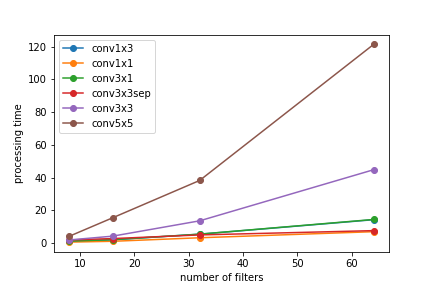
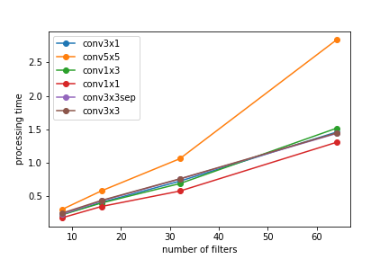
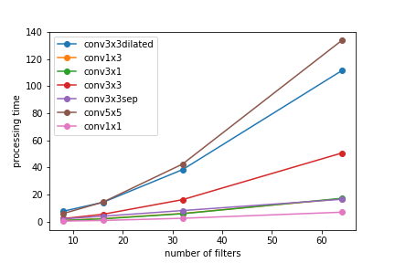
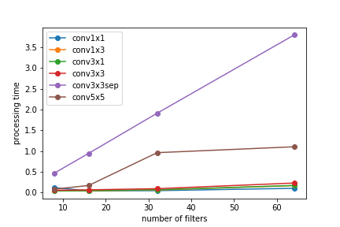

# conv-benchmark

# Results

### Keras CPU

||conv1x1|conv3x1|conv1x3|conv3x3sep|conv3x3|conv5x5|
|:-:|:-:|:-:|:-:|:-:|:-:|:-:|
|processing time [sec]|6.693|14.083|14.022|7.197|43.729|118.820|
|vs 3x3|0.153|0.322|0.321|0.165|1.000|2.717|
|theoretical complexity|0.111|0.333|0.333|0.016|1.000|2.778|

### Keras GPU

||conv1x1|conv3x1|conv1x3|conv3x3sep|conv3x3|conv5x5|
|:-:|:-:|:-:|:-:|:-:|:-:|:-:|
|processing time [sec]|1.303|1.457|1.514|1.436|1.443|2.835|
|vs 3x3|0.903|1.009|1.049|0.995|1.000|1.965|
|theoretical complexity|0.111|0.333|0.333|0.016|1.000|2.778|

### PyTorch CPU

||conv1x1|conv3x1|conv1x3|conv3x3sep|conv3x3|conv5x5|
|:-:|:-:|:-:|:-:|:-:|:-:|:-:|
|processing time [sec]|6.920|17.099|17.088|16.628|48.608|133.599|
|vs 3x3|0.142|0.352|0.352|0.342|1.000|2.748|
|theoretical complexity|0.111|0.333|0.333|0.016|1.000|2.778|

### PyTorch GPU

||conv1x1|conv3x1|conv1x3|conv3x3sep|conv3x3|conv5x5|
|:-:|:-:|:-:|:-:|:-:|:-:|:-:|
|processing time [sec]|0.102|0.173|0.169|3.786|0.230|1.108|
|vs 3x3|0.441|0.750|0.733|16.447|1.000|4.816|
|theoretical complexity|0.111|0.333|0.333|0.016|1.000|2.778|